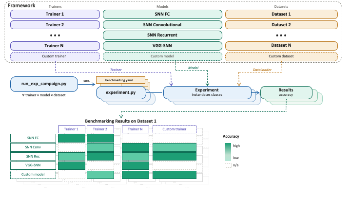
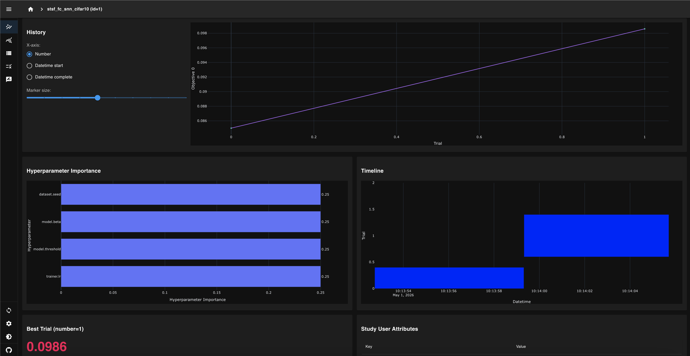

# NeuroTrain

**An open benchmarking framework for SNN training algorithms.**




NeuroTrain is an open framework for implementing, comparing, and benchmarking SNN training algorithms under shared, controlled conditions. Trainers, networks, and datasets are fully decoupled — any combination can be benchmarked from a single config file. Hyperparameter optimization via [Optuna](https://optuna.org) is built-in: mark any parameter as tunable directly in YAML and set `opt: true` to run a study. This makes it possible to separate algorithmic contributions from experimental choices — something that is typically hard when algorithms live in heterogeneous, one-off codebases.

NeuroTrain accompanies a survey paper providing a comprehensive taxonomy of SNN training algorithms — see the [paper](#citation) for background and the full algorithmic landscape.

Built on **[snnTorch](https://github.com/jeshraghian/snntorch)** (≥ 0.7), **[Tonic](https://github.com/neuromorphs/tonic)** (≥ 1.0), and **[NeuroBench](https://github.com/NeuroBench/neurobench)**.

>  &nbsp; Developed at the **SMILIES Research Group**, Dept. of Control and Computer Engineering, Politecnico di Torino. &nbsp;·&nbsp; [Website](https://www.smilies.polito.it/) &nbsp;·&nbsp; [LinkedIn](https://www.linkedin.com/company/smilies-polito) &nbsp;·&nbsp; [𝕏](https://x.com/smiliespolito)

> <a name="citation"></a>**If you use NeuroTrain in your research, please cite:**
>
> Caviglia, A., Marostica, F., Bardini, R., Savino, A., & Di Carlo, S. (2026). *NeuroTrain: surveying Local Learning Rules for Spiking Neural Networks with an Open Benchmarking Framework*. arXiv preprint. https://arxiv.org/abs/PLACEHOLDER

## Quickstart

```bash
git clone https://github.com/smilies-polito/neurotrain
cd neurotrain
pip install -r requirements.txt

# Benchmark matrix: all trainers × models × datasets declared in config/benchmarking.yaml
python3 run_exp_campaign.py --benchmarking config/benchmarking.yaml --name my_bench

# Custom experiment with optional Optuna HPO
python3 run_exp_campaign.py --custom config/experiments.yaml --name my_exp

# Reproduce paper results (fill config/paper.yaml with best Optuna outputs first)
make paper
```

---

## Contents

- [SNN Training Algorithms Benchmarking Results](#snn-training-algorithms-benchmarking-results)
- [Benchmark Your SNN Training Algorithm](#benchmark-your-snn-training-algorithm)
- [Run Custom Experiments](#run-custom-experiments)
- [Under the Hood — How NeuroTrain Works](#under-the-hood--how-neurotrain-works)
  - [Design Principles](#design-principles)
  - [Repository Structure](#repository-structure)
  - [Configuration System](#configuration-system)
  - [NeuroBench Evaluation](#neurobench-evaluation)
  - [Output Structure and Results Generation](#output-structure-and-results-generation)
  - [Visualising HPO Results](#visualising-hpo-results)
  - [Singularity / Apptainer](#singularity--apptainer)
  - [Dependencies](#dependencies)
- [Reproduce the Paper Benchmarking Results](#reproduce-the-paper-benchmarking-results)
- [Development Status](#development-status)
  - [Implemented Algorithms](#implemented-algorithms)
  - [Networks and Datasets](#networks-and-datasets)
  - [Validated Integration Results](#validated-integration-results)
  - [Testing](#testing)
  - [HPC / SLURM](#hpc--slurm)
  - [Trainer Notes](#trainer-notes)
- [License](#license)

---

# SNN Training Algorithms Benchmarking Results

*Last updated: PLACEHOLDER DATE — updated with each major release. Full per-dataset tables and reproduction instructions: [Reproduce the Paper Benchmarking Results](#reproduce-the-paper-benchmarking-results).*


---

# Benchmark Your SNN Training Algorithm

> NeuroTrain is designed for researchers who have developed a new SNN training algorithm and want to benchmark it systematically under fair, controlled conditions. For a complete step-by-step guide see **[`docs/HOW_TO_BENCHMARK_YOUR_TRAINER.md`](docs/HOW_TO_BENCHMARK_YOUR_TRAINER.md)**.

The typical workflow proceeds in four steps:

**Step 1 — Implement your trainer.**
Create `src/trainers/<name>_trainer.py` extending `BaseTrainer`, implement `train_sample()` and `reset()`, then register it in `src/trainers/__init__.py`:

```python
from trainers.my_trainer import MyTrainer
TRAINER_REGISTRY["my_trainer"] = MyTrainer
```

**Step 2 — Add default config and compatibility.**
Create `config/default/trainers/my_trainer.yaml` with default hyperparameters and the `supported_net_types` list. Compatibility with models and datasets is resolved automatically from these YAML fields — no separate registration needed.

**Step 3 — Run HPO.**
Add your experiment to `config/experiments.yaml` with `opt: true` and tunable parameter blocks. Run:

```bash
python3 run_exp_campaign.py --custom config/experiments.yaml --name my_trainer_hpo
```

Optuna runs a study for each experiment and writes the best config to `experiments/<name>/<exp>/optuna/best_params.yaml`.

**Step 4 — Run your benchmark and generate results.**

```bash
# Option A — your trainer only, against all compatible combinations
python3 run_exp_campaign.py --benchmarking config/benchmarking.yaml --name my_bench

# Option B — rerun the full matrix including your trainer
python3 run_exp_campaign.py --benchmarking config/benchmarking.yaml --name full_bench

# Generate tables and heatmap from the campaign output
python3 scripts/generate_results.py experiments/my_bench/
```

---

# Run Custom Experiments

NeuroTrain supports a wide range of customisation — from selecting a specific subset of algorithms for a campaign, to overriding individual hyperparameters, to adding entirely new trainers, models, and datasets. All combinations are supported.

For a complete guide see **[`docs/HOW_TO_RUN_CUSTOM_EXPERIMENTS.md`](docs/HOW_TO_RUN_CUSTOM_EXPERIMENTS.md)**. A quick overview:

- **Custom benchmarking campaign** — create your own `benchmarking.yaml` selecting any subset of trainers, models, and datasets:

```bash
python3 run_exp_campaign.py --benchmarking config/custom/my_campaign.yaml --name my_bench
```

- **Custom parameters** — override any default hyperparameter (trainer, model, or dataset) in `config/experiments.yaml` without touching the default configs:

```bash
python3 run_exp_campaign.py --custom config/experiments.yaml --name my_exp
```

- **New components** — add your own trainer ([guide](docs/HOW_TO_BENCHMARK_YOUR_TRAINER.md)), model, or dataset and use them in any campaign immediately after registration.

- **HPO on any of the above** — add `opt: true` and tunable blocks to any experiment in either mode.

---

## Design Principles

NeuroTrain separates three orthogonal concerns — *how to train*, *what to train*, and *what data to use* — and wires them together at runtime from a YAML config.

```
Input YAML (benchmarking or custom)
    │
    ▼
campaign_builder  ──→  list[ExperimentSpec]
                               │
           run_exp_campaign.py spawns experiment.py per spec
                               │
                               ▼
                    experiment.py
                      ├─ get_loader(dataset)
                      ├─ get_network(model)
                      ├─ TRAINER_REGISTRY[trainer]
                      ├─ train_one_epoch × epochs
                      ├─ evaluate
                      └─ neurobench_eval  (if enabled)
                               │
                               ▼
             experiments/<campaign>/
               summary.json   summary.csv
               <exp_name>/  config.yaml  metrics.json  log.txt
```

Every trainer implements `train_sample()` and `reset()` from `BaseTrainer`. Every network implements `forward()` and `reset()` from `BaseSNN`. Compatibility between trainers, models, and datasets is declared via `supported_net_types` in each component's default YAML and resolved automatically by `src/campaign/compatibility.py`.

## Repository Structure

```
neurotrain/
│
├── run_exp_campaign.py            # Main entry point (benchmarking + custom modes)
├── experiment.py                  # Single-experiment runner (called per spec)
│
├── config/
│   ├── benchmarking.yaml          # Benchmarking mode: lists trainers, models, datasets
│   ├── experiments.yaml           # Custom mode: named experiments with overrides + HPO
│   ├── paper.yaml                 # Post-HPO best configs for paper results
│   ├── default/
│   │   ├── trainers/              # One YAML per trainer (defaults + tunable blocks)
│   │   ├── models/                # One YAML per network (with per-dataset sections)
│   │   └── datasets/              # One YAML per dataset (timesteps, batch size, etc.)
│   ├── benchmarking/              # Per-trainer benchmarking configs (trainer × dataset)
│   ├── custom/                    # User-created experiment files (not tracked by git)
│   └── vgg9/                      # VGG9-specific experiment configs
│
├── src/
│   ├── trainers/                  # Learning algorithm implementations
│   │   ├── base_trainer.py        # Abstract interface: train_sample() + reset()
│   │   ├── __init__.py            # TRAINER_REGISTRY — maps name → class
│   │   └── …                      # One file per algorithm
│   ├── networks/                  # SNN architectures (fc_snn, r_snn, conv_snn, vgg9*)
│   ├── datasets/                  # Dataset loaders
│   └── campaign/                  # Orchestration layer
│       ├── campaign_builder.py    # Builds ExperimentSpec list from YAML
│       ├── compatibility.py       # Trainer × model × dataset compatibility
│       ├── config_loader.py       # YAML loading and deep-merge logic
│       ├── training_loop.py       # train_one_epoch, evaluate
│       ├── neurobench_eval.py     # NeuroBench integration
│       ├── optuna_helpers.py      # Tunable block resolution
│       └── results.py             # Output writing (summary.csv, summary.json)
│
├── scripts/
│   └── generate_results.py        # Generate Markdown tables + heatmap from summary.csv
│
├── tests/                         # Integration and dataloader tests
├── hpc/                           # SLURM sbatch scripts
├── docs/
│   ├── HOW_TO_BENCHMARK_YOUR_TRAINER.md
│   ├── HOW_TO_RUN_CUSTOM_EXPERIMENTS.md
│   ├── configs_guide.md
│   └── figures/                   # framework.png, results_heatmap.png, LOGO_WEB.png
├── Makefile
└── pyproject.toml
```

## Configuration System

NeuroTrain has two operating modes, both launched via `run_exp_campaign.py`. Internally, it spawns `experiment.py` once per resolved `ExperimentSpec` — you can also call `experiment.py <spec.json> <output_dir>` directly to debug a single run.

### Benchmarking mode

Declares which trainers, models, and datasets to compare. The campaign builder generates all valid combinations automatically.

```yaml
# config/benchmarking.yaml
trainers: [bptt, ostl]   # empty list = all in config/default/trainers/
models:   [fc_snn]
datasets: [MNIST, FashionMNIST]
runtime:
  epochs: 50
  device: cuda
  seed: 42
  neurobench: false      # set true to run NeuroBench evaluation after training
opt: false               # set true to run Optuna for every combination
optuna:
  n_trials: 50
  sampler: tpe
```

```bash
python run_exp_campaign.py --benchmarking config/benchmarking.yaml --name my_bench
make bench                  # uses config/benchmarking.yaml by default
make dry-bench              # print experiment list without running
```

### Custom mode

Defines named experiments with explicit overrides. Supports per-experiment Optuna HPO.

```yaml
# config/experiments.yaml
my_experiment:
  trainer:
    name: bptt
    lr: 5e-4
  model:
    name: fc_snn
    hidden_sizes: [128]
  dataset:
    name: MNIST
    T: 25
  runtime:
    epochs: 50
    device: cuda

my_tuned_experiment:
  opt: true
  optuna:
    n_trials: 50
  trainer:
    name: stsf
    lr:
      value: 1e-3
      type: float
      min: 1e-5
      max: 1e-1
      log: true
  model:
    name: fc_snn
    beta:
      value: 0.9
      type: float
      min: 0.5
      max: 0.99
  dataset:
    name: FashionMNIST
  runtime:
    epochs: 20
```

```bash
python run_exp_campaign.py --custom config/experiments.yaml --name my_exp
make custom
make dry-custom
```

### Tunable parameter blocks

Any scalar in a trainer, model, or dataset config can be made tunable by replacing it with a block:

```yaml
lr:
  value: 1e-3        # used when opt: false
  type: float        # float | int | categorical
  min: 1e-5
  max: 1e-1
  log: true          # log-scale sampling

loss_type:
  value: ce_rate
  type: categorical
  list: [ce_rate, mse_count, ce_count]
```

For the complete config reference see [`docs/configs_guide.md`](docs/configs_guide.md).

## NeuroBench Evaluation

NeuroTrain integrates [NeuroBench](https://github.com/NeuroBench/neurobench) for standardised neuromorphic evaluation. When `neurobench: true` is set in the `runtime` block, a full NeuroBench benchmark is run on the trained model after each experiment and its results are written to `metrics.json` alongside the standard training metrics.

Enable it in either mode:

```yaml
runtime:
  neurobench: true
```

The following metrics are computed automatically:

**Static metrics** (computed once on the model):

| Metric | Description |
|---|---|
| `Footprint` | Memory footprint of the model weights |
| `ConnectionSparsity` | Fraction of zero-valued synaptic connections |
| `ParameterCount` | Total number of trainable parameters |

**Workload metrics** (computed during inference on the test set):

| Metric | Description |
|---|---|
| `ClassificationAccuracy` | Test accuracy via NeuroBench harness |
| `ActivationSparsity` | Overall spike sparsity across all layers |
| `ActivationSparsityByLayer` | Per-layer spike sparsity breakdown |
| `MembraneUpdates` | Number of membrane potential updates per inference |

All NeuroBench results are stored under a `neurobench` key in `metrics.json` and included in the campaign-level `summary.csv` with `nb_` prefix columns, enabling direct comparison of efficiency metrics across algorithms alongside accuracy.

## Output Structure and Results Generation

### Campaign outputs

Each campaign produces per-experiment outputs plus a campaign-level summary:

```
experiments/<campaign>/
  campaign.yaml                ← copy of the input config
  summary.json                 ← all experiments, one dict per run
  summary.csv                  ← flat table: trainer, model, dataset,
                                  test_accuracy, train_loss, elapsed_s,
                                  epochs, nb_* (NeuroBench columns)
  <exp_name>/
    config.yaml                ← resolved config for this run
    metrics.json               ← per-epoch metrics + NeuroBench results
    log.txt
    optuna/                    ← only when opt: true
      trials.csv
      best_params.yaml
      study.db                 ← SQLite, open with optuna-dashboard
```

### Generating results tables and heatmap

`scripts/generate_results.py` reads `summary.csv` (or `summary.json`) from a campaign directory and produces:

- **`results_tables.md`** — one Markdown accuracy table per dataset (trainer × model), with mean ± std where multiple seeds are available. Ready to paste into the README or a paper draft.
- **`results_heatmap.png`** — one subplot per dataset, rows = trainers, columns = models, cells colour-coded by test accuracy, values annotated inline.
- **`neurobench_table.md`** — NeuroBench metrics table across all experiments (with `--neurobench`).

```bash
# Basic: tables + heatmap
python scripts/generate_results.py experiments/paper/

# Include NeuroBench metrics table
python scripts/generate_results.py experiments/paper/ --neurobench

# Save outputs to a custom directory
python scripts/generate_results.py experiments/paper/ --output docs/results/

# Inject tables directly into README (between marker comments)
python scripts/generate_results.py experiments/paper/ --readme README.md

# Skip the heatmap (text tables only)
python scripts/generate_results.py experiments/paper/ --no-heatmap
```

**Auto-injection into README:** the results tables in this file are bounded by HTML comment markers. Running the script with `--readme README.md` replaces the content between them automatically with the selected results:


<!-- RESULTS_START -->

*Results from campaign `full_bench`. Generated by `scripts/generate_results.py`.*


*NeuroTrain — Benchmarking Results · Campaign: `full_bench` · 2026-04-30 21:57*

### CIFAR-10

*Test accuracy (mean ± std where multiple seeds available).*

| Algorithm | Conv-SNN | FC-SNN | R-SNN |
|---|---|---|---|
| BPTT | 34.5% | 32.1% | 30.4% |
| DECOLLE | 28.1% | 31.8% | — |

### DVSGesture

*Test accuracy (mean ± std where multiple seeds available).*

| Algorithm | Conv-SNN | FC-SNN | R-SNN |
|---|---|---|---|
| BPTT | 46.6% | 52.7% | 48.9% |
| DECOLLE | 51.5% | 63.6% | — |

### Fashion-MNIST

*Test accuracy (mean ± std where multiple seeds available).*

| Algorithm | Conv-SNN | FC-SNN | R-SNN |
|---|---|---|---|
| BPTT | 75.8% | 79.6% | 79.5% |
| DECOLLE | 65.7% | 65.2% | — |

### MNIST

*Test accuracy (mean ± std where multiple seeds available).*

| Algorithm | Conv-SNN | FC-SNN | R-SNN |
|---|---|---|---|
| BPTT | 97.8% | 95.2% | 94.9% |
| DECOLLE | 80.3% | 83.2% | — |

### N-MNIST

*Test accuracy (mean ± std where multiple seeds available).*

| Algorithm | Conv-SNN | FC-SNN | R-SNN |
|---|---|---|---|
| BPTT | 97.1% | 93.7% | 93.2% |
| DECOLLE | 82.3% | 77.8% | — |

### SVHN

*Test accuracy (mean ± std where multiple seeds available).*

| Algorithm | Conv-SNN | FC-SNN | R-SNN |
|---|---|---|---|
| BPTT | 74.3% | 37.2% | 35.6% |
| DECOLLE | 49.2% | — | — |

<!-- RESULTS_END -->


### Visualising HPO Results

When `opt: true` is set, NeuroTrain saves an Optuna SQLite study database for each experiment:

```text
experiments/<campaign>/experiments/<exp_name>/optuna/study.db
```

Use [optuna-dashboard](https://github.com/optuna/optuna-dashboard) to inspect trial history, hyperparameter importances, parallel coordinate plots, and convergence behaviour in the browser.

Launch the dashboard using the **absolute path** to the study database:

```bash
optuna-dashboard "sqlite:////absolute/path/to/study.db"
```

For example:

```bash
optuna-dashboard "sqlite:////home/user/neurotrain/experiments/<campaign>/experiments/<exp_name>/optuna/study.db"
```

The dashboard is served at:

```text
http://localhost:8080
```

Using an absolute path avoids SQLite path-resolution issues, especially inside Singularity or cluster shells.


*optuna-dashboard for a trainer × model × dataset combination.*

## Singularity / Apptainer

For reproducible execution on HPC clusters, NeuroTrain can be containerised with Singularity (Apptainer).

**1. Build:**

```bash
sudo singularity build neurotrain.sif src/snn-training-benchmarking.def
# without root:
singularity build --fakeroot neurotrain.sif src/snn-training-benchmarking.def
```

**2. Run:**

```bash
singularity exec --nv \
    --bind /path/to/neurotrain:/workspace \
    neurotrain.sif \
    bash -c "cd /workspace && python run_exp_campaign.py \
        --benchmarking config/benchmarking.yaml --name my_bench"
```

**3. SLURM + Singularity** — set `APPTAINER_IMAGE` before submitting; the sbatch scripts in `hpc/` handle the rest:

```bash
export APPTAINER_IMAGE=/path/to/neurotrain.sif
sbatch hpc/bench_bptt_mnist.sbatch
```

## Dependencies

| Package | Version | Role |
|---|---|---|
| [torch](https://pytorch.org) | ≥ 2.0 | Core deep learning |
| [snntorch](https://github.com/jeshraghian/snntorch) | ≥ 0.7 | LIF neuron models, surrogate gradients — core SNN engine |
| [tonic](https://github.com/neuromorphs/tonic) | ≥ 1.0 | Event-based dataset loading (N-MNIST, DVSGesture, SHD, DVS-CIFAR10) |
| [neurobench](https://github.com/NeuroBench/neurobench) | latest | Neuromorphic benchmarking metrics and datasets |
| [optuna](https://optuna.org) | ≥ 3.0 | Built-in hyperparameter optimisation |
| `pandas` | ≥ 2.0 | Results table generation (`scripts/generate_results.py`) |
| `matplotlib` | ≥ 3.7 | Heatmap generation (`scripts/generate_results.py`) |
| `pyyaml` | ≥ 6.0 | Config parsing |

```bash
pip install -r requirements.txt
```

**Requirements:** Python ≥ 3.9, CUDA optional (MPS and CPU supported via `device: auto`).

---

# Reproduce the Paper Benchmarking Results

Paper results are stored in `config/paper.yaml` — one named experiment per trainer × model × dataset combination, with HPO-optimised hyperparameters as plain scalar values.

```bash
# Reproduce all paper results
make paper
# equivalent to:
python run_exp_campaign.py --custom config/paper.yaml --name paper

# Generate the tables and heatmap from the paper campaign
python scripts/generate_results.py experiments/paper/ --neurobench --readme README.md
```

Each run logs the full config, seed, and git commit hash to `experiments/paper/<exp_name>/`, ensuring every result is traceable.

<!-- RESULTS_START -->

### MNIST

*Test accuracy, rate-coded input, 10 classes.*

| Algorithm | FC-SNN | Conv-SNN | R-SNN |
|---|---|---|---|
| BPTT | — | — | — |
| OSTL | — | — | — |
| E-prop | — | — | — |
| ESD-RTRL | — | — | — |
| ETLP | — | — | — |
| STSF | — | — | — |
| DRTP | — | — | — |
| OTTT | — | — | — |

### Fashion-MNIST

*Test accuracy, rate-coded input, 10 classes.*

| Algorithm | FC-SNN | Conv-SNN | R-SNN |
|---|---|---|---|
| BPTT | — | — | — |
| OSTL | — | — | — |
| E-prop | — | — | — |
| ESD-RTRL | — | — | — |
| ETLP | — | — | — |
| STSF | — | — | — |
| DRTP | — | — | — |
| OTTT | — | — | — |

### CIFAR-10

*Test accuracy, rate-coded input, 10 classes.*

| Algorithm | Conv-SNN | VGG9 | R-SNN |
|---|---|---|---|
| BPTT | — | — | — |
| E-prop | — | — | — |
| ESD-RTRL | — | — | — |
| DRTP | — | — | — |
| OTTT | — | — | — |
| STOP | — | — | — |

### SVHN

*Test accuracy, rate-coded input, 10 classes.*

| Algorithm | Conv-SNN | VGG9 | R-SNN |
|---|---|---|---|
| BPTT | — | — | — |
| E-prop | — | — | — |
| ESD-RTRL | — | — | — |
| OTTT | — | — | — |

### N-MNIST

*Test accuracy, event-based neuromorphic input, 10 classes.*

| Algorithm | FC-SNN | R-SNN |
|---|---|---|
| BPTT | — | — |
| OSTL | — | — |
| OSTTP | — | — |
| E-prop | — | — |
| ESD-RTRL | — | — |
| ETLP | — | — |
| OTTT | — | — |

### DVSGesture

*Test accuracy, event-based neuromorphic input, 11 gesture classes.*

| Algorithm | Conv-SNN | VGG9 | R-SNN |
|---|---|---|---|
| BPTT | — | — | — |
| E-prop | — | — | — |
| ESD-RTRL | — | — | — |
| DECOLLE | — | — | — |
| OTTT | — | — | — |

